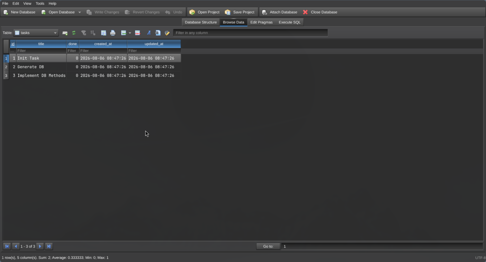
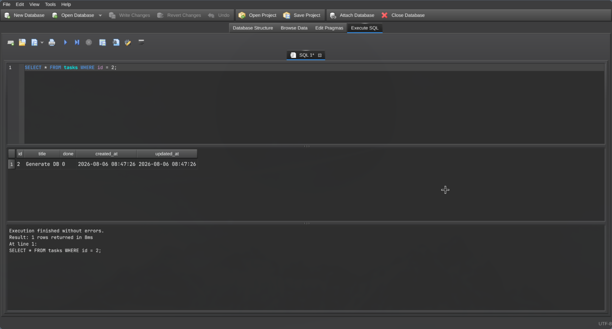
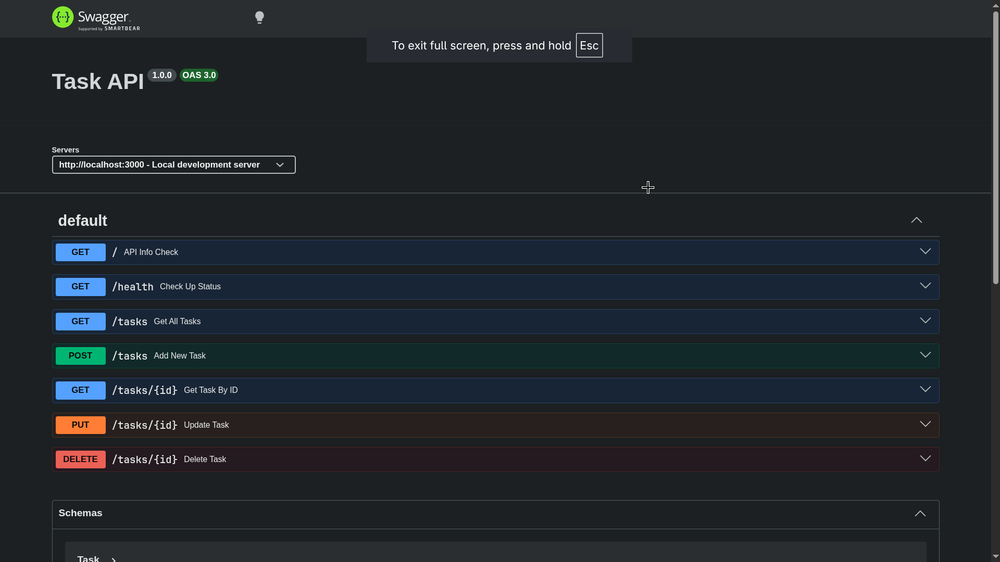

## Task API (CRUD Application)

A lightweight Node.js and Express RESTful API backed by SQLite (better-sqlite3), complete with built-in OpenAPI specifications and Swagger UI documentation.

### Why SQLite?

SQLite was chosen for this project because it provides a self-contained, serverless, and zero-configuration SQL database engine. It allows for fast local development, eliminates the need for managing external database services, and integrates seamlessly with Node.js using `better-sqlite3` for synchronous, high-performance query execution.

---

### Database Storage

The SQLite database file is stored locally in the root directory of the project:

```
./tasks.db
```

---

### Installation & Execution

To install dependencies and start the development server with a single command, run:

```bash
npm install && npm run dev

```

---

### Endpoints Overview

| Method     | Endpoint      | Description                              |
| ---------- | ------------- | ---------------------------------------- |
| **GET**    | `/`           | Returns API info and available endpoints |
| **GET**    | `/health`     | Returns server health status             |
| **GET**    | `/tasks`      | Retrieves all tasks                      |
| **GET**    | `/tasks/{id}` | Retrieves a single task by ID            |
| **POST**   | `/tasks`      | Creates a new task                       |
| **PUT**    | `/tasks/{id}` | Updates an existing task by ID           |
| **DELETE** | `/tasks/{id}` | Deletes a task by ID                     |

---

### Database Viewer




---

### Browser-based docs



---

### Terminal API Testing Script (`test-api.sh`)

While interactive Swagger UI documentation is available for browser-based testing at `/docs`, a `test-api.sh` script is included to simulate the entire CRUD workflow directly within your terminal.

#### Script Contents

```bash
printf "[Root Check]\n\n"

curl -i http://localhost:3000/

printf "\n\n[Health Check]\n\n"

curl -i http://localhost:3000/health

printf "\n\n[Get All Tasks]\n\n"

curl -i http://localhost:3000/tasks

printf "\n\n[Get Task ID 1]\n\n"

curl -i http://localhost:3000/tasks/1

printf "\n\n[Get 404 Error on wrong IDS]\n\n"

curl -i http://localhost:3000/tasks/99

printf "\n\n[Add New Task]\n\n"

curl -i -X POST http://localhost:3000/tasks -H "Content-Type: application/json" -d '{"title":"Buy milk"}'

printf "\n\n[Check Added Task]\n\n"

curl -i http://localhost:3000/tasks

printf "\n\n[Update a Task]\n\n"

curl -i -X PUT http://localhost:3000/tasks/4 -H "Content-Type: application/json" -d '{"title":"Buy milk","done":true}'

printf "\n\n[Check Updated Task]\n\n"

curl -i http://localhost:3000/tasks

printf "\n\n[Delete a Task]\n\n"

curl -i -X DELETE http://localhost:3000/tasks/4 -H "Content-Type: application/json"

printf "\n\n[Check Deleted Task]\n\n"

curl -i http://localhost:3000/tasks/4

```

#### Running the Script

Make the script executable and run it while your server is active:

```bash
chmod +x test-api.sh
./test-api.sh

```
