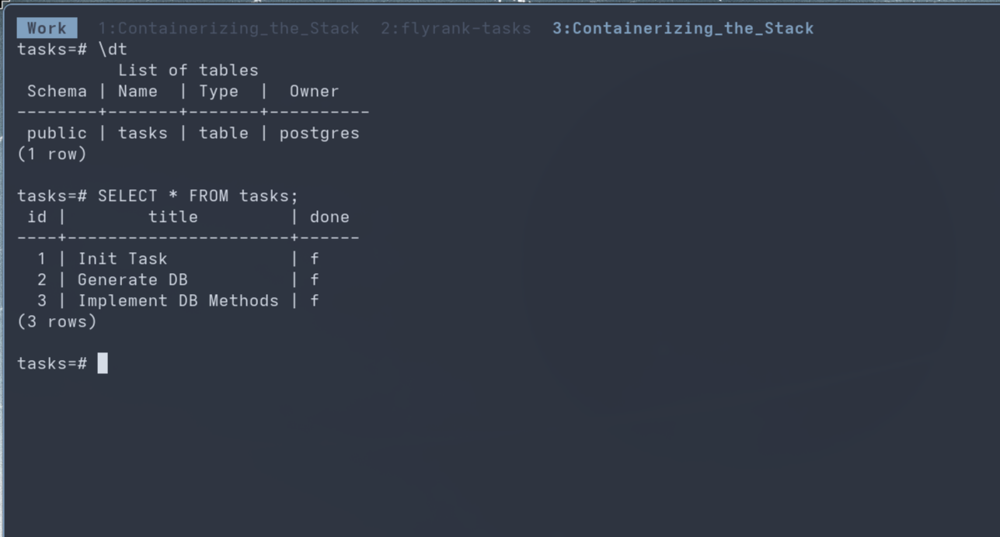

## Task API (Containerized PostgreSQL & Node.js CRUD Application)

A lightweight Node.js and Express RESTful API backed by PostgreSQL, running entirely inside a containerized Docker environment. It includes built-in OpenAPI specifications and interactive Swagger UI documentation at `/docs`.

---

### Quickstart (One Command Setup)

To spin up the entire application—including the Node.js API server and the PostgreSQL database with automated table migrations and seeding—run:

```bash
docker compose up --build
```

> **Environment Configuration:**
> Copy `.env.example` to `.env` before running. The Compose configuration automatically loads variables from `.env` to configure your PostgreSQL container credentials and your application's `DATABASE_URL`.

---

### Endpoints Overview

| Method     | Endpoint      | Description                              |
| ---------- | ------------- | ---------------------------------------- |
| **GET**    | `/`           | Returns API info and available endpoints |
| **GET**    | `/health`     | Returns server health status             |
| **GET**    | `/tasks`      | Retrieves all tasks                      |
| **GET**    | `/tasks/{id}` | Retrieves a single task by ID            |
| **POST**   | `/tasks`      | Creates a new task                       |
| **PUT**    | `/tasks/{id}` | Updates an existing task by ID           |
| **DELETE** | `/tasks/{id}` | Deletes a task by ID                     |

---

### Terminal API Example

You can test any endpoint using `curl`. Here is an example of fetching all tasks:

```bash
curl -i http://localhost:3000/tasks

```

**Example Response:**

```http
HTTP/1.1 200 OK
Content-Type: application/json; charset=utf-8
Content-Length: 172

[
  {"id":1,"title":"Init Task","done":false},
  {"id":2,"title":"Generate DB","done":false},
  {"id":3,"title":"Implement DB Methods","done":false}
]

```

---

### Database Verification

To verify the database tables and data inside the PostgreSQL container using `psql`, execute:

```bash
docker compose exec db psql -U postgres -d tasks

```

Inside the `psql` shell, run `\dt` to inspect relations and execute SQL queries:


